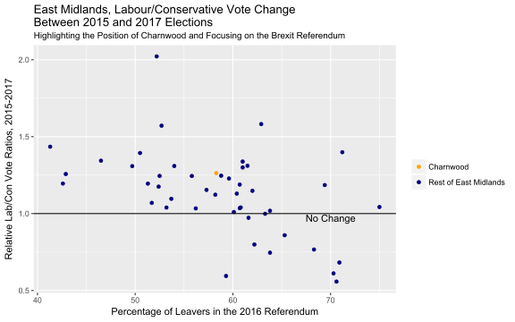

# A Set of Contributed Graphs with Brief Commentary

## Authors

- David Firth
- Nayia Constantinou
- Jamie Wreathall
- Tina Goldarreh
- Kevin Choi

(add your name as a new bullet-point to the above list)

## The contributions

### David

 530       Staffordshire South

This plot shows, for all constituencies in the West Midlands region, the relationship between electoral change (between Conservative and Labour parties, at the 2015 and 2017 General Elections) and the percentage of people aged 18-24 according to the 2011 census.

Perhaps surprisingly, gains for Labour (over the Conservatives) appear to have been largest in those West Midlands seats where there were fewest young people resident according to the census.

The majority of West Midlands constituencies show some gain for Labour over Conservative.  The *Staffordshire South* constituency, highlighted in red in the plot, appears to be fairly typical as far as these two variables are concerned.

**The above is just an illustrative example of the sort of graph and text you might include in this file.  I fully expect that some of the graphs you'll produce will be more interesting than this one!**

### Nayia
57 Birmingham Edgbaston

Same plot as Prof. Firth's above but now the *Birmingham Edgbaston* constituency is highlighted in red in the plot. 

The *Birmingham Edgbaston* constituency is similar to the majority of constituencies with regards to the Relative LabCon vote ratios between 2015 and 2017, as it shows some gain for Labour over Conservative. However, it differs from the majority of constituencies with regards to the percentage of people aged 18-24 according to the 2011 census in the West Midlands, as it is one of the 4 consituencies with the largest percentage of young people (above 15%). 

### Alex

 428         Northampton South

### Alice

 289      Hampshire North West

### Anthony

 631  Wolverhampton South East

### Anushka

 309  Hertfordshire North East
 
### Billy

 578                 Tottenham
 
### Christopher

 137       Chatham & Aylesford
 
### Dan

 531        Stalybridge & Hyde

### Declan

 562                  Tamworth
 
### Diana

 391               Meon Valley
 
### Dominic

 599          Warrington North
 
### Florence

 237             Enfield North

### Isaac

 184            Derbyshire Mid

### Ivana

 495          Salford & Eccles

### Jamie

 432           Nottingham East
 
 
 
 Young voter turnout is often very low in elections, so it is not surprising to see that there is a positive correlation between non-voting and there being a lot of young people in a constituency.

Nottingham East had a very high number of people aged 18-24 compared to other constituencies in the 2011 census and also had a very high percentage of non-voters in the 2015 General Election.

### Kevin

 293 Harrogate & Knaresborough

It can be observed that in all but two constituencies (Rotherham and Wentworth & Dearne) the labour to lib dem voter ratio has increased. In particular, Rotheram and Wentworth & Dearne both have very small lib dem vote share compared to labour's vote share.

Interestingly, there is a constituency, Bradford East, where the relative vote ratio is up to 22.4. Looking carefully at the data, this is mainly because the Lib Dems only retained 6.89% of their 2015 votes (a drop of 27.7 percentage points in absolute terms), whilst labour had a gain of 54.5% of their 2015 votes (an increase of 18.7 percentage points in absolute terms). This extraordinary change may be due to Lib Dem's 2015 candidate decided to stand as an Independent, retaining a 7.8% vote share in 2017.

We can observe that Harrogate fits well into the pattern for the relative vote ratio, with a value of 1.86. Although in this constituency, there was a gain in Lib Dem votes, there had been an even larger gain for labour, in both relative and absolute terms. Moreover, Harrogate was the only constituency in the whole region where the Lib Dem vote was higher than the Labour vote in 2017! This compared to 2015 when the Lib Dems had two seats in this region - Greg Mulholland in Leeds North West and Nick Clegg in Sheffield Hallam.

### Kishan

  38                 Battersea

### Lewis

 563                    Tatton

### Matt D

 591                 Wakefield

### Matthew J

 482                 Rotherham

### Matthew N

 248          Feltham & Heston

### Matthew Y

 451              Peterborough

### Miraj

 392                   Meriden

### Namik

 317    Hornchurch & Upminster

### Nathan

 252  Finchley & Golders Green

### Ollie

 516                  Solihull

### Stefana

 593             Walsall North

### Tina

 136                 Charnwood
 
 

This is a plot of the East Midlands constituencies showing the relationship between electoral change, (between Conservative and Labour party; a higher value on the y-axis corresponds to gains for Labour relative to the Conservatives), during the 2015 and 2017 general elections and the percentage of the electorate who voted in each constituency for Brexit in the 2016 referendum. 

In the East Midlands, as the number of Brexiteers increases, Labour loses seats to the Conservatives. This is not surprising since the Labour party campaigned heavily to remain in the EU. 

In most of the East Midland constituencies Labour gained against Conservatives. *Charnwood*, highlighted in orange, seems to be a fairly typical constituency based on the data provided on these two variables.

### Weiyi

  54          Bexhill & Battle

### Zsigmond

 644               Wyre Forest
