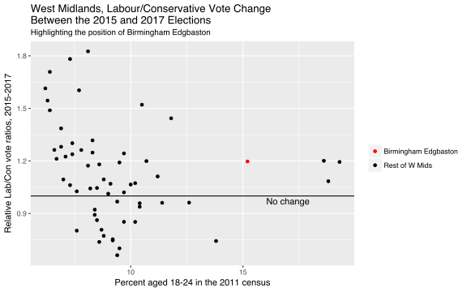
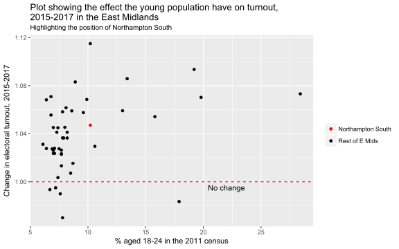
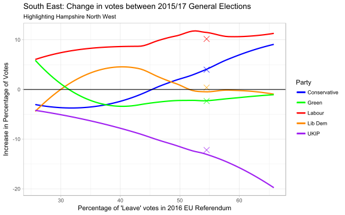
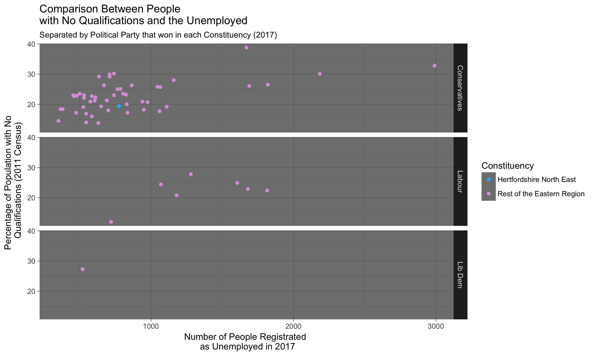
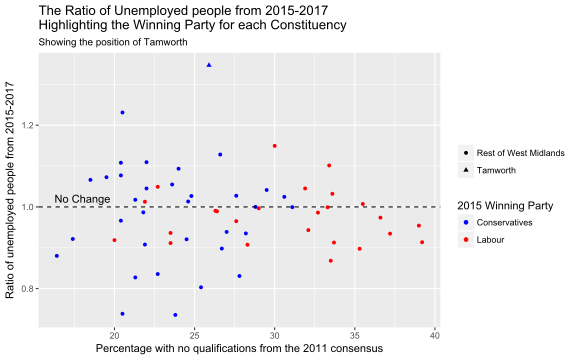
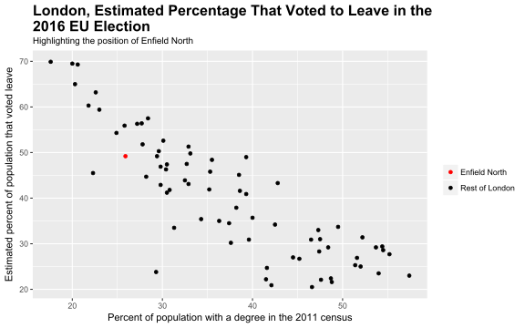
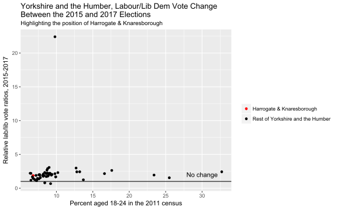
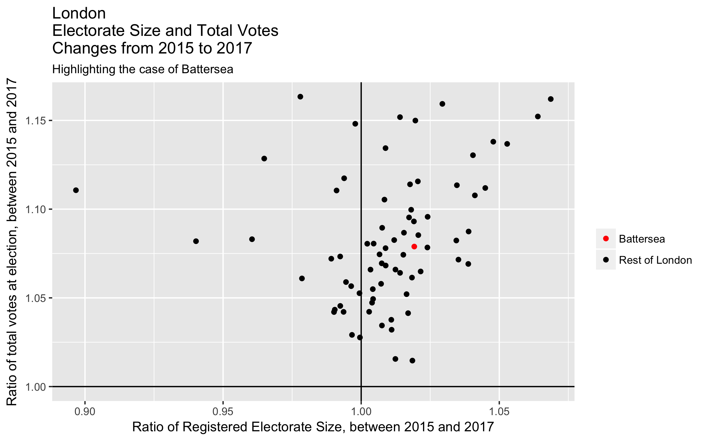
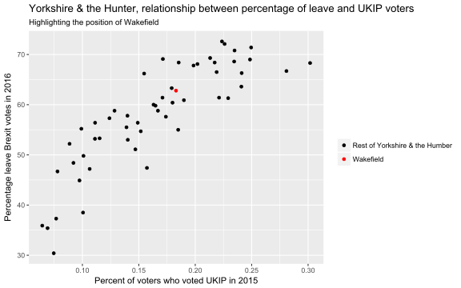

# A Set of Contributed Graphs with Brief Commentary

## Authors

- David Firth
- Nayia Constantinou
- Jamie Wreathall
- Tina Goldarreh
- Kevin Choi
- Alice Saxton
- Alex Flint
- Florence Welsh
- Matt Davies
- Kishan Radia
- Miraj Shah
- Anushka Katailiha
- Declan Wardell

(add your name as a new bullet-point to the above list)

## The contributions

### David

 530       Staffordshire South

This plot shows, for all constituencies in the West Midlands region, the relationship between electoral change (between Conservative and Labour parties, at the 2015 and 2017 General Elections) and the percentage of people aged 18-24 according to the 2011 census.

Perhaps surprisingly, gains for Labour (over the Conservatives) appear to have been largest in those West Midlands seats where there were fewest young people resident according to the census.

The majority of West Midlands constituencies show some gain for Labour over Conservative.  The *Staffordshire South* constituency, highlighted in red in the plot, appears to be fairly typical as far as these two variables are concerned.

**The above is just an illustrative example of the sort of graph and text you might include in this file.  I fully expect that some of the graphs you'll produce will be more interesting than this one!**

### Nayia
57 Birmingham Edgbaston

Same plot as Prof. Firth's above but now the *Birmingham Edgbaston* constituency is highlighted in red in the plot. 

The *Birmingham Edgbaston* constituency is similar to the majority of constituencies with regards to the Relative LabCon vote ratios between 2015 and 2017, as it shows some gain for Labour over Conservative. However, it differs from the majority of constituencies with regards to the percentage of people aged 18-24 according to the 2011 census in the West Midlands, as it is one of the 4 consituencies with the largest percentage of young people (above 15%). 

### Alex

 428         Northampton South
 
 
 
 I have looked further into the patterns of young voters in the East Midlands. This plot shows the relationship between electoral turnout changes (between the 2015 and 2017 general elections) and the percentage of the population aged between 18 and 24 from the 2011 census. 

As expected, electoral turnout tended to increase sharply in the constituencies of the East Midlands which had higher percentages of young voters in 2011. However, in all but five East Midland constintuencies there was a increase in percentage turnout in 2017 compared with 2015. 

Northampton South, highlighted in red, showed very typical results for the East Midlands. To build upon these findings I would suggest finding out the proportion of teenagers in each constituency to see if this affects my findings.

### Alice

 289      Hampshire North West
 
 
 
 This plot shows the relationship between the increase of each party's percentage of votes for the 2015 and 2017 General Elections, against the estimated percentage of 'Leave' votes in the 2016 EU Referendum. The lines that have been plotted are based on all of the constituencies in the South East. It also highlights the data points that represent the Hampshire North West data for this relationship.

Labour is the only party to not see a decrease in vote percentage across all constituencies, and has the largest increase at all points. However, when considering Hampshire North West, there is not as large an increase as the plot would suggest for a constituency with a Leave percentage of that size. Looking at the plot, a possible explanation for this could be that both the percentages for UKIP and the Lib Dems have not decreased as much as would be expected.

Another interesting pattern in this plot is the almost symmetric shapes of the Conservative and UKIP lines which becomes more pronounced where the Leave percentage is higher. This could suggest that lots of people who voted UKIP in 2015 and supported the outcome of the EU Referendum, then transferred their support to the Conservative Party in the 2017 Election.

### Anthony

 631  Wolverhampton South East

### Anushka

 309  Hertfordshire North East
 
 
 
 The graph above compares the number of people registered as unemployed in 2017 against the proportion of the population without a qualification in 2011, highlighting Hertfordshire North East's position amongst the rest of the Eastern region. 

An obvious observation is that the Conservative party proved to be quite popular in the 2017 General Election in the Eastern region -  all but 8 constituencies voted mainly for the Conservative party. Like the majority of the constituencies in our region, Hertfordshire North East mainly voted for the Conservatives and has relatively low levels of unemployment and also a low proportion of people with no qualifications.

Since we have little data for constituencies that mainly voted for Labour and Liberal Democrats, we will focus on constituencies that casted majority of their votes in favour of the Conservatives to draw our conclusions from. 

Firstly, we notice that there is somewhat a positive correlation between the proportion of people that have no qualifications and the number of unemployed. This correlation seems plausible since, qualifications to some extent, impact employability of a person.  

Another observation that can be made is that constituencies with lower levels of unemployment were more likely to vote for Conservatives. This is deduced from the fact that there is a cluster of points in the bottom left corner of the top graph. Although there seems to be a correlation between these two variables, we cannot determine whether this implies causation; further analysis would be required to confirm this.

However, we encounter a problem with conclusion drawn above - the graph indicates the number of people that were registered as unemployed in 2017, not the proportion of the population that was unemployed in 2017. Therefore, a constituency could have a small number of unemployed but that could be a large proportion of its constituency population, implying that the level of unemployment, in real terms is quite high, and vice versa.

 
### Billy

 578                 Tottenham
 
### Christopher

 137       Chatham & Aylesford
 
### Dan

 531        Stalybridge & Hyde

### Declan

 562                  Tamworth
 
 
 
 My plot shows the relationship between the ratio of unemployment and the percentage of people with no qualifications. On the graph is also the winning parties for each constituency. Without this additional data there would not be much to be said about the data.
 
 Purely by looking at the 'line of no change' and comparing between Labour and the Conservatives it is quite clear to see that we have differing observations. For the Conservatives the number of constituencies that have increased their number of unemployed people, is roughly equal to the number of constituencies that have decreased the number of unemployed. Whereas the Labour party's constituencies have reduced the number of unemployed people in most cases. So the graph shows that Labour were far better at reducing the number of unemployed people per constituency.
 
We also can see that the 14 constituencies with the highest percentage of no qualifications all voted for Labour which shows another trend. This could be explained by Labour's slogan for the 2015 election: “Better Plan for a Better Future”, which may have swayed a few people towards a Labour vote.

The region I looked at, Tamworth, was in fact the worst constituency in terms of ratios of unemployment. It has a fairly similar percentage of people who were unemployed as other constituencies so there must have been other reasons that caused this.
 
### Diana

 391               Meon Valley
 
### Dominic

 599          Warrington North
 
### Florence

 237             Enfield North
 
 
  
This plot shows the relationship between the estimated percentage of voters voting to leave in the 2016 EU election and the percentage of the population with a degree in the 2011 census, for the London region with Enfield North highlighted in red. 
  
A negative correlation is shown in the plot, with the estimated percent of the population that voted leave being highest in the constituencies with the lowest percentage of the population with a degree. Moreover, the lower estimated percentages voting leave occurs in the constituencies with the highest percentage of the population with a degree. The Enfield North constituency has a lower percentage of the population with a degree than the majority of the London constituencies. With an estimation of just under 50% of the population voting to leave, Enfield North fits with the overall trend of the plot.

### Isaac

 184            Derbyshire Mid

### Ivana

 495          Salford & Eccles

### Jamie

 432           Nottingham East
 
 
 
 Young voter turnout is often very low in elections, so it is not surprising to see that there is a positive correlation between non-voting and there being a lot of young people in a constituency.

Nottingham East had a very high number of people aged 18-24 compared to other constituencies in the 2011 census and also had a very high percentage of non-voters in the 2015 General Election.

### Kevin

 293 Harrogate & Knaresborough

It can be observed that in all but two constituencies (Rotherham and Wentworth & Dearne) the labour to lib dem voter ratio has increased. In particular, Rotheram and Wentworth & Dearne both have very small lib dem vote share compared to labour's vote share.

Interestingly, there is a constituency, Bradford East, where the relative vote ratio is up to 22.4. Looking carefully at the data, this is mainly because the Lib Dems only retained 6.89% of their 2015 votes (a drop of 27.7 percentage points in absolute terms), whilst labour had a gain of 54.5% of their 2015 votes (an increase of 18.7 percentage points in absolute terms). This extraordinary change may be due to Lib Dem's 2015 candidate decided to stand as an Independent, retaining a 7.8% vote share in 2017.

We can observe that Harrogate fits well into the pattern for the relative vote ratio, with a value of 1.86. Although in this constituency, there was a gain in Lib Dem votes, there had been an even larger gain for labour, in both relative and absolute terms. Moreover, Harrogate was the only constituency in the whole region where the Lib Dem vote was higher than the Labour vote in 2017! This compared to 2015 when the Lib Dems had two seats in this region - Greg Mulholland in Leeds North West and Nick Clegg in Sheffield Hallam.

### Kishan

  38                 Battersea

This plot shows, for all constituencies in the "London" region, the relationship between electorate size and the total number of votes counted. In particular, we are looking at the changes between the 2015 and 2017 general elections.

As expected, for all constituencies in which the registered electorate size increased, the total number of votes at election did as well. However in over a quarter of the "London" constituencies, where the electorate size decreased, we also saw an increase in the total number of votes counted (there were no "London" constituencies where the total votes decreased). The most extreme case showed an increase of votes by over 10%, alongside a decrease of electorate size by over 10%.

As for the Battersea case, highlighted in red in the plot, this constituency appears to be fairly typical as far as these two variables are concerned.

### Lewis

 563                    Tatton

### Matt D

 591                 Wakefield

The graph shows, for all constituencies in Yorkshire and the Humber region, there is a positive relationship between the percentage of leave Brexit votes in 2016 and the percentage of UKIP voters in the general election of 2015. Wakefield specifically also follows this trend.

The likely reason for this relationship is that UKIP were extremely pro-Brexit, meaning that people that voted for them will likely have a similar opinion and will want to leave the EU.

It also appears that the majority of constituencies in Yorkshire and the Humber region were in favour for leaving the EU since they have more than 50% of voters voting leave. However, the percentage of people voting UKIP is extremely small, the most being a little over 0.3%. This is likely due to few people agreeing with the other extremist views despite the high percentage of pro-Brexit voters within the region.

### Matthew J

 482                 Rotherham

### Matthew N

 248          Feltham & Heston

### Matthew Y

 451              Peterborough

### Miraj

 392                   Meriden
 
 
 
The plot above shows the the relationship between the estimated percentage of people who voted Leave in the 2016 EU Referendum and the percentage of each constituencies' total votes, that were in favour of UKIP in the 2015 General Election, for all constituencies in the West Midlands region. Additionally, the size of each point in the plot corresponds to the percentage of each constituencies' total votes that were in favour of UKIP in the 2017 General Election.

Since UKIP fought hard to advertise the advantages of Brexit, it's unsurprising to see positive correlation between voting for UKIP and voting to leave the EU, since many UKIP supporters in 2015 would have shared their party's view towards leaving the EU and voted accordingly. Meriden, highlighted in red in the plot, appears to follow the similar trend represented by other West Midlands constituencies.

Looking at the size of each point allows us to gauge how the popularity of UKIP has changed from 2015 to 2017. At first glance, it would be easy to suggest that in many constituencies, UKIP gained no votes at all, due to the percentage of total votes equalling 0%. However, it is important to consider how many of these constituencies actually had a UKIP candidate standing for a seat in Parliament. If every one of these constituencies had an UKIP candidate, then the lack of votes for UKIP clearly shows a decline in popularity for the party. On the other hand, if there were no candidates representing UKIP in these constituencies, then the percentage of votes in favour for UKIP does not give an accurate representation of the party's popularity with the public.

Assuming that all constituencies with 0% of votes in favour of UKIP, are constituencies where there was no candidate running on behalf of UKIP, it is interesting to see the decline in the party's representation within constituencies - which may be due to the public's opinion of UKIP. UKIP played a major role in the run up to the EU referendum, which may have increased support and caused a rise in the number of candidates representing UKIP in the 2015 election. However, once the Leave result was achieved, UKIP supporters may have then switched their support towards other parties, reducing the number of candidates running on behalf of UKIP in the 2017 election.

### Namik

 317    Hornchurch & Upminster

### Nathan

 252  Finchley & Golders Green

### Ollie

 516                  Solihull

### Stefana

 593             Walsall North

### Tina

 136                 Charnwood
 
 

This is a plot of the East Midlands constituencies showing the relationship between electoral change, (between Conservative and Labour party; a higher value on the y-axis corresponds to gains for Labour relative to the Conservatives), during the 2015 and 2017 general elections and the percentage of the electorate who voted in each constituency for Brexit in the 2016 referendum. 

In the East Midlands, as the number of Brexiteers increases, Labour loses seats to the Conservatives. This is not surprising since the Labour party campaigned heavily to remain in the EU. 

In most of the East Midland constituencies Labour gained against Conservatives. *Charnwood*, highlighted in orange, seems to be a fairly typical constituency based on the data provided on these two variables.

### Weiyi

  54          Bexhill & Battle

### Zsigmond

 644               Wyre Forest
